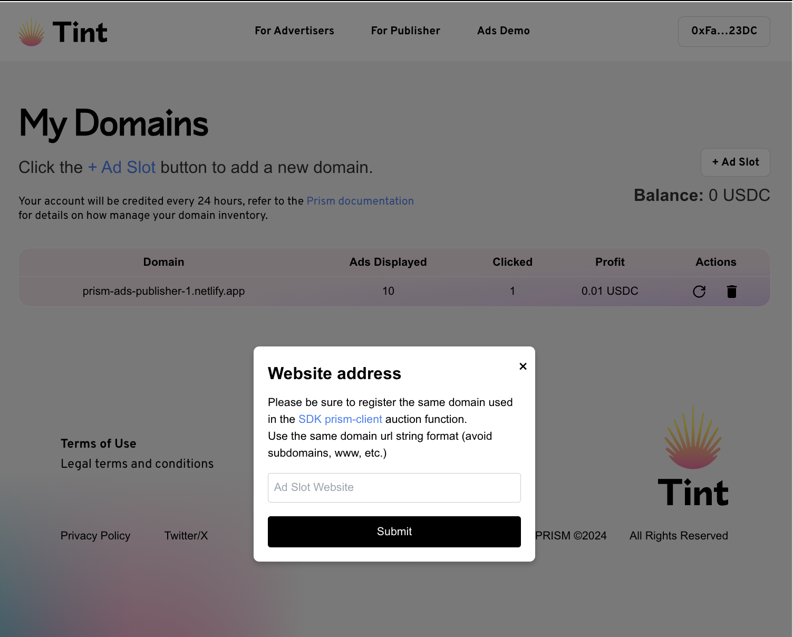

# Prism SDK

TypeScript client for Prism protocol onchain advertising. Prism Engine finds high-value users for your campaign using on-chain data. Compete in a real-time auction and display your ads to relevant users.

## Installation

```bash
npm install prism-sdk
# or
yarn add prism-sdk
```

## Auth
- Address whitelisted: Please refer to the [Prism Protocol documentation](https://github.com/PrismAgents/documentation/wiki/TINT-Home) for more information on how to get whitelisted as publisher.

## Publisher SDK Demo

- [Publisher website](https://prism-ads-publisher-1.netlify.app/)
- Implementation [example](https://github.com/PrismAgents/advertising-sdk-publisher-demo/blob/main/src/pages/index.ts) with NextJS

## Usage

### Import and Initialize

```typescript
import { PrismClient ,PrismWinner} from 'prism-sdk';
```

### - Get Auction Winner Campaign from Nitro Enclave TEE

```typescript
// Trigger auction React example
  useEffect(() => {
      const fetchData = async () => {
        if (address) {
          const winner : PrismWinner = await PrismClient.auction(
            publisherAddress,
            publisherDomain,
            address
          );
          setPrismWinner(winner);
        }
      };
      fetchData();
  }, [address]);
```
- Auction Response : PrismWinner
```typescript
interface PrismWinner {
    jwt_token: string; // SDK will add jwt token to clicks and impressions calls
    bannerIpfsUri: string;
    campaignId: string;
    campaignName: string;
    url: string;
}
```


**Important:** The methods clicks/impressions on the `PrismClient` are
crucial for tracking and claiming publishers profit.

### - Register ads impressions

```typescript
// Register impressions
await PrismClient.impressions(
      publisherAddress,
      publisherDomain,
      prismWinner.campaignId,
      prismWinner.jwt_token
    )
```

### - Register ads clicks


```typescript
// Register clicks on ads
 PrismClient.clicks(
        address,
        prismWinner.url,
        prismWinner.campaignId,
        prismWinner.jwt_token
      )
```


## Publisher Dashboard

Access your analytics and earnings at the [Publisher's Dashboard](https://tint.prismprotocol.xyz/dashboard/publisher)



## Development

```bash
# Install dependencies
npm install

# Run development build with watch mode
npm run dev

# Run tests
npm test

# Build for production
npm run start
```

## License

MIT