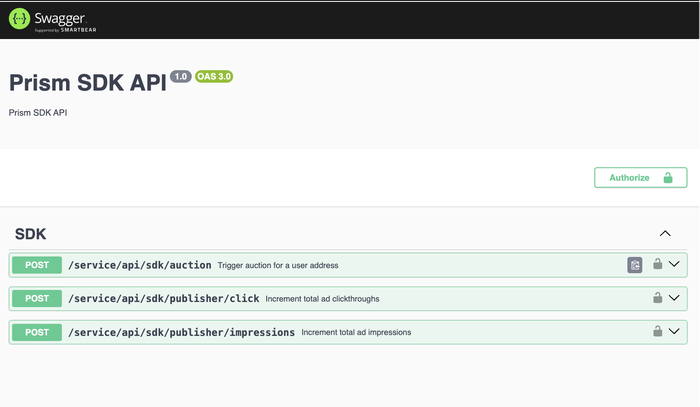

# Prism SDK

TypeScript client for Prism protocol onchain advertising. Prism Engine finds high-value users for your campaign using on-chain data. Compete in a real-time auction and display your ads to relevant users.

## Installation

```bash
npm install prism-sdk
# or
yarn add prism-sdk
```

## Auth

- API Key: Please refer to the [Prism Protocol documentation](https://github.com/PrismAgents/documentation/wiki/TINT-Home) for more information on how to get an API KEY & get whitelisted as publisher.
- Address whitelisted: Please refer to the [Prism Protocol documentation](https://github.com/PrismAgents/documentation/wiki/TINT-Home) for more information on how to get whitelisted as publisher.

## Publisher SDK Demo

- [Publisher website](https://tint.prismprotocol.xyz/client)
- Implementation [example](https://github.com/PrismAgents/advertising-sdk-publisher-demo/blob/main/src/pages/api/route.ts) with NextJS

## Usage

### Import and Initialize

```typescript
import { PrismClient } from 'prism-sdk';

// Initialize the client with your API key
const client = new PrismClient('your-api-key');
```

### API Methods

```typescript
// Trigger an auction when publisher wants to display an ad
const auctionResult = await client.auction(
  'publisher-address',     // Publisher's Ethereum address
  'publisher-domain.com',  // Publisher's domain
  'user-wallet-address'    // User's Ethereum address
);

// Handle a user click on an ad (call this on img onClick())
const clickResult = await client.clicks(
  'publisher-address',     // Publisher's Ethereum address
  'website-url.com',       // Website URL where click occurred
  'campaign-id'            // Campaign ID that was clicked
);

// Send an impression when ad is viewed (call this on img onLoad())
const viewResult = await client.impressions(
  'publisher-address',     // Publisher's Ethereum address
  'website-url.com',       // Website URL where impression occurred
  'campaign-id'            // Campaign ID that was viewed
);
```

**Important:** The methods on the `PrismClient` must be called to submit feedback, reviews, and clicks. This is crucial for tracking the analytics of your publishing websites and the displayed ads on the Prism Protocol publishers' space. Additionally, it allows you to claim the profit as a publisher.

## Publisher Dashboard

Access your analytics and earnings at the [Publisher's Dashboard](https://tint.prismprotocol.xyz/dashboard/publisher)


## Prism Publisher API

### API Documentation

- [SDK Swagger Documentation](https://tint.prismprotocol.xyz/service/api/sdk)
- ⚠️ Remember to add the header: 'x-api-key': <your-api-key>, in all requests ⚠️



## Development

```bash
# Install dependencies
npm install

# Run development build with watch mode
npm run dev

# Run tests
npm test

# Type check
npm run typecheck

# Build for production
npm run build
```

## License

MIT